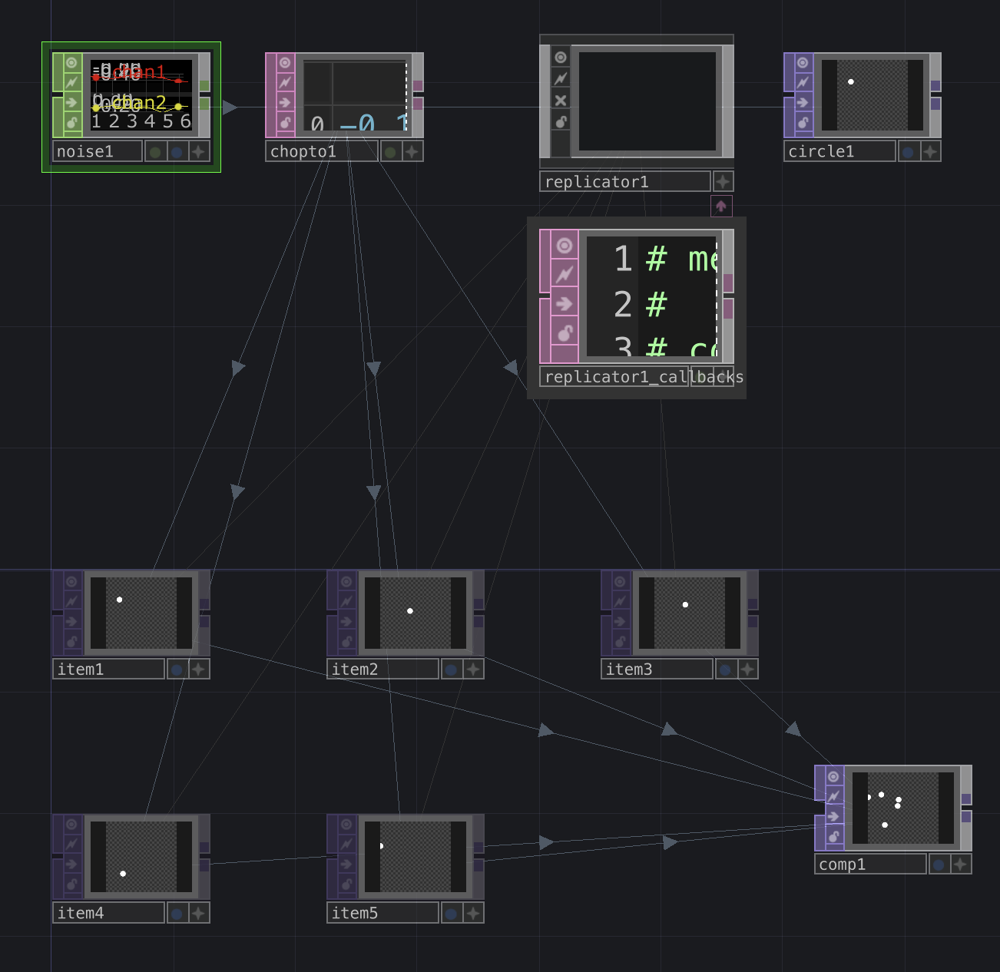
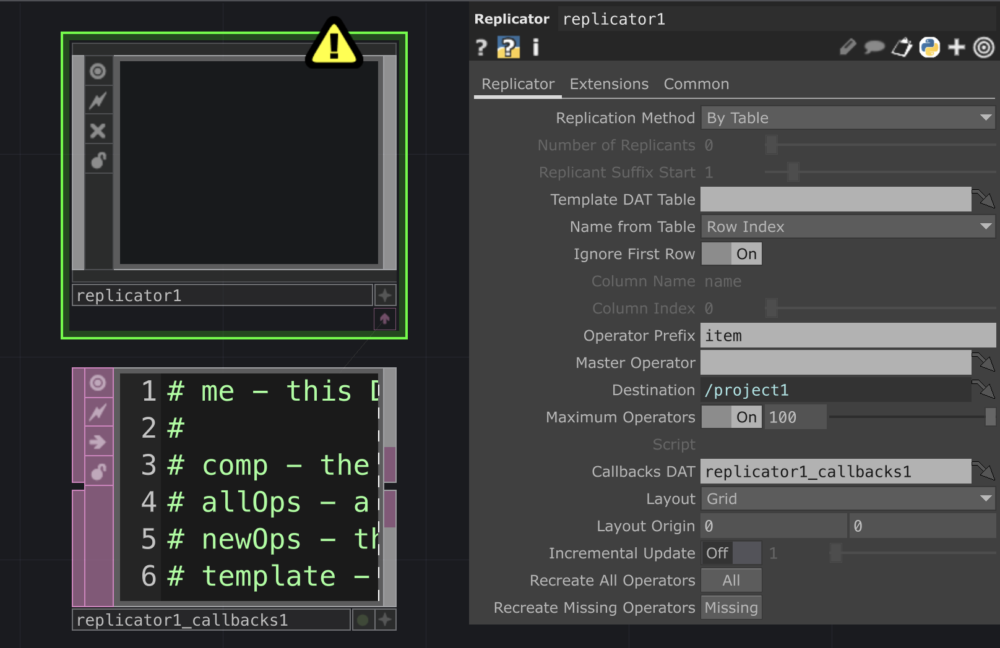
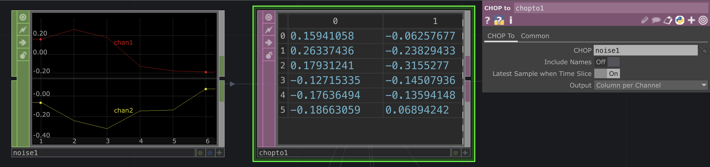
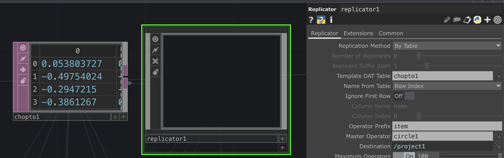
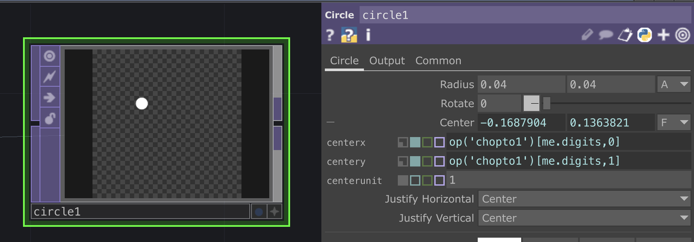
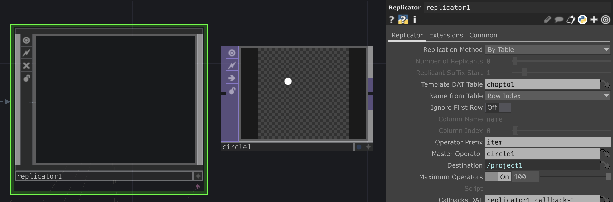
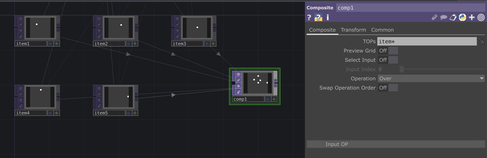

# Replicator COMP in TouchDesigner

*On how to use the Replicator COMP in TouchDesigner to clone components with a data DAT.*

- The [introduction to Touchdesigner](https://github.com/LucieMrc/IntroTD)

*Replicator basic network*

# The Replicator COMP

The `Replicator` COMP will create "clones" items based on a "master" object, using a database. We need to specify to the Replicator which DAT is the data base in the "Template DAT Table" parameter and which node is the master in the "Master Operator" parameter.

We can choose the name of the "clones" nodes with the "Operator Prefix" parameter (default is "item").

# The database

We need to create a database knowing we'll have as many clones as there is rows in the table, and we can have as many column as needed.

Here, I create a table with a `Noise` CHOP and then a `CHOP to` DAT, where I get 6 rows and 2 columns that will allows me to create 6 clones with X and Y positions.

In the `Replicator` COMP, I drag and drop the `CHOP to` DAT in the "Template DAT Table" parameter.
I also choose "Row Index" in the "Name From Table" parameter (which should be the default), and I turn off "Ignore First Row" as the first row are datas.

# The master

The master node can be a TOP, a SOP, etc, or a `Base` COMP 
Le master node peut être un TOP, un SOP, etc, ou une `Base` COMP depending on the needs and complexity of the network.

In order to have clones copying the master with datas from the database, we need said dates to be in one or multiples of its parameters.

Here, I want to create 6 circles that moves based on the `Noise` CHOP datas. 

I create a `Circle` TOP :

To have the circle moving, I need to change the X and Y "Center" parameter that defines the position of the center of the circle.

We select one of the cells of the `chopto1` table by writing "op('chopto1')" to select the node, then "[me.digits, 0]" to select the cell from the row "me.digits" and the column 0 for the X parameter (and  "[me.digits, 1]" for the column 1 for the Y parameter).

"me.digits" allows us to get the index from the clone to get the datas from its row.

I also decreased the size of the circle with the "Radius" parameter.

Finally, we drag and drop the "circle1" node on the "Master Operator" in the `Replicator` COMP.

# Compose the clones items

We have 6 clones, named from item1 to item6.
To compose and display them in the same TOP, we create a `Composite` TOP.
In the "TOPs" parameter of the Composite, we write "item*" to select every nodes which name starts with "item".
The asterisk * means "all".

We can do the same thing with a `Merge` SOP if the items are 3D objects.